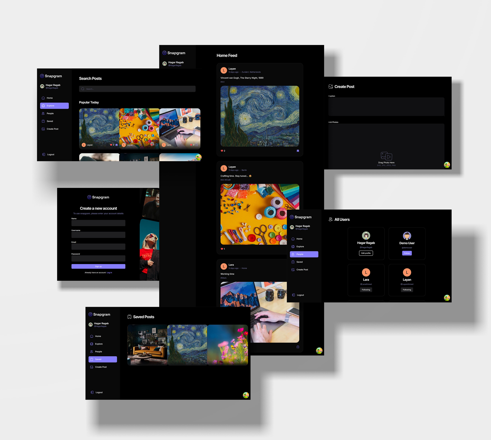

# 📱 Snapgram – A Modern Social Media Application

<div align="center">


**A fully responsive, feature-rich social media platform built with modern web technologies**

[](https://react.dev/)
[](https://www.typescriptlang.org/)
[](https://vitejs.dev/)
[](https://appwrite.io/)
[](LICENSE)

</div>

---

## 📖 Table of Contents

- [Overview](#overview)
- [Features](#features)
- [Screenshots](#screenshots)
- [Tech Stack](#tech-stack)
- [Prerequisites](#prerequisites)
- [Installation](#installation)
- [Configuration](#configuration)
- [Environment Variables](#environment-variables)
- [Running the Application](#running-the-application)
- [Project Structure](#project-structure)
- [Testing](#testing)
- [Contributing](#contributing)
- [License](#license)

---

## 🎯 Overview

**Snapgram** is a production-ready social media application built with React and TypeScript. It provides users with a seamless platform to share content, connect with others, and engage with posts through likes, saves, and comments. The application leverages Appwrite as a serverless backend solution for authentication, database management, and file storage.

Built following modern development best practices, Snapgram implements:

- **Type-safe development** with TypeScript
- **Component-driven architecture** with reusable UI components
- **Efficient state management** with TanStack Query
- **Robust form validation** using React Hook Form and Zod
- **Responsive design** with Tailwind CSS and shadcn/ui
- **Clean code organization** with proper separation of concerns

---

## ✨ Features

### Authentication & User Management

- **Secure Authentication**: Sign up and login with email/password using Appwrite Auth
- **Profile Management**: Update display name, profile picture, and bio
- **User Discovery**: Browse and discover other users on the platform

### Content Creation & Interaction

- **Post Creation**: Create posts with image uploads and captions
- **Post Editing**: Edit existing post captions and images
- **Like System**: Like and unlike posts with real-time updates
- **Save Posts**: Save posts to view later in a dedicated collection
- **Comment System**: Engage with posts through comments (UI ready)

### Social Features

- **Follow System**: Follow/unfollow users to build your network
- **Personalized Feed**: View posts from users you follow
- **Explore Page**: Discover trending posts and new content
- **Search Functionality**: Real-time search for posts by captions

### User Experience

- **Responsive Design**: Optimized for desktop, tablet, and mobile devices
- **Loading States**: Smooth loading indicators and skeleton screens
- **Error Handling**: Comprehensive error boundaries and user-friendly error messages
- **Dark Mode Support**: Built-in theme switching capability
- **Intuitive Navigation**: Bottom navigation bar for mobile, sidebar for desktop

---

## 🖼️ Screenshots

<div align="center">



_Snapgram Interface Overview_

</div>

---

## 🛠️ Tech Stack

### Frontend Framework

- **React 19.0** - UI library
- **TypeScript 5.7** - Type-safe JavaScript
- **Vite 6.1** - Build tool and dev server

### Styling & UI

- **Tailwind CSS 4.0** - Utility-first CSS framework
- **shadcn/ui** - Reusable UI components built on Radix UI
- **Lucide React** - Icon library
- **next-themes** - Theme management

### Routing & State Management

- **React Router 7.1** - Client-side routing
- **TanStack Query 5.66** - Data fetching and caching
- **React Context API** - Global state management

### Forms & Validation

- **React Hook Form 7.54** - Form state management
- **Zod 3.24** - Schema validation
- **@hookform/resolvers** - Form validation integration

### Backend Services

- **Appwrite 17.0** - Serverless backend platform
    - Authentication
    - Database (Document storage)
    - Storage (File management)

### Utilities

- **clsx & tailwind-merge** - Conditional class names
- **react-dropzone** - File upload handling
- **react-intersection-observer** - Infinite scroll & lazy loading
- **sonner** - Toast notifications

### Development Tools

- **ESLint** - Code linting
- **TypeScript ESLint** - TypeScript-specific linting
- **PostCSS & Autoprefixer** - CSS processing

---

## 📋 Prerequisites

Before you begin, ensure you have the following installed:

- **Node.js** (v18.0 or higher) - [Download here](https://nodejs.org/)
- **npm** (comes with Node.js) or **yarn** / **pnpm**
- **Git** - [Download here](https://git-scm.com/)
- **Appwrite Account** - [Sign up free](https://appwrite.io/)

---

## 🚀 Installation

### 1. Clone the Repository

```bash
git clone https://github.com/yourusername/social-app-snapgram.git
cd social-app-snapgram
```

### 2. Install Dependencies

```bash
npm install
# or
yarn install
# or
pnpm install
```

### 3. Set Up Appwrite Project

1. Go to [Appwrite Console](https://cloud.appwrite.io/)
2. Create a new project
3. Navigate to **Settings** and copy your **Project ID** and **Project Endpoint**
4. Create the following resources in your Appwrite project:

#### Database Setup

- Create a database named `snapgram_db`
- Create the following collections:

**Users Collection**

- Attributes:
    - `accountId` (string)
    - `name` (string)
    - `username` (string)
    - `email` (string)
    - `imageUrl` (string)
    - `bio` (string)

**Posts Collection**

- Attributes:
    - `caption` (string)
    - `imageUrl` (string)
    - `imageId` (string)
    - `creator` (string - reference to Users)
    - `tags` (array)
    - `location` (string)

**Saves Collection**

- Attributes:
    - `user` (string - reference to Users)
    - `post` (string - reference to Posts)

**Likes Collection**

- Attributes:
    - `user` (string - reference to Users)
    - `post` (string - reference to Posts)

#### Storage Setup

- Create a storage bucket named `posts`
- Configure permissions for read/write access

---

## ⚙️ Configuration

### Environment Variables

Create a `.env.local` file in the root directory and add the following variables:

```env
VITE_APPWRITE_PROJECT_ID=your_project_id
VITE_APPWRITE_PROJECT_URL=your_project_endpoint
```

Replace the placeholder values with your actual Appwrite credentials.

### Appwrite Configuration

Update the Appwrite configuration in `src/lib/appwrite/appwrite.ts` if needed:

```typescript
import { Client, Account, Databases, Storage, ID } from "appwrite";

const client = new Client()
    .setProject(import.meta.env.VITE_APPWRITE_PROJECT_ID)
    .setEndpoint(import.meta.env.VITE_APPWRITE_PROJECT_URL);

export const account = new Account(client);
export const databases = new Databases(client);
export const storage = new Storage(client);
export { ID };
```

---

## 🏃 Running the Application

### Development Mode

Start the development server:

```bash
npm run dev
# or
yarn dev
# or
pnpm dev
```

The application will be available at `http://localhost:5173`

### Production Build

Build the application for production:

```bash
npm run build
# or
yarn build
# or
pnpm build
```

The optimized files will be generated in the `dist` directory.

### Preview Production Build

Preview the production build locally:

```bash
npm run preview
# or
yarn preview
# or
pnpm preview
```

### Linting

Run ESLint to check for code issues:

```bash
npm run lint
# or
yarn lint
# or
pnpm lint
```

---

## 📁 Project Structure

```
social-app-snapgram/
├── public/                      # Static assets
│   └── assets/
│       ├── icons/              # SVG icons
│       └── images/             # Logo and placeholder images
├── src/
│   ├── _auth/                  # Authentication module
│   │   ├── AuthLayout.tsx      # Auth page layout
│   │   └── forms/
│   │       ├── SigninForm.tsx  # Login form
│   │       └── SingupForm.tsx  # Registration form
│   ├── _root/                  # Main application module
│   │   ├── RootLayout.tsx      # Root layout with navigation
│   │   └── pages/              # Page components
│   │       ├── AllUsers.tsx    # Discover users page
│   │       ├── CreatePost.tsx  # Create new post
│   │       ├── EditPost.tsx    # Edit existing post
│   │       ├── Explore.tsx     # Explore trending posts
│   │       ├── Home.tsx        # Home feed
│   │       ├── LikedPosts.tsx  # User's liked posts
│   │       ├── PageNotFound.tsx # 404 page
│   │       ├── PostDetails.tsx # Single post view
│   │       ├── Profile.tsx     # User profile
│   │       ├── ProfilePosts.tsx # Profile posts grid
│   │       ├── ProtectedRoute.tsx # Route protection wrapper
│   │       ├── Saved.tsx       # Saved posts collection
│   │       └── UpdateProfile.tsx # Update profile form
│   ├── components/             # Reusable components
│   │   ├── forms/              # Form components
│   │   │   ├── PostForm.tsx    # Post creation/editing form
│   │   │   └── ProfileForm.tsx # Profile update form
│   │   ├── shared/             # Shared UI components
│   │   │   ├── Bottombar.tsx   # Mobile bottom navigation
│   │   │   ├── EditProfileButton.tsx
│   │   │   ├── FileUploader.tsx # File upload component
│   │   │   ├── FollowButton.tsx # Follow/unfollow button
│   │   │   ├── GridPostList.tsx # Posts grid layout
│   │   │   ├── GridUserList.tsx # Users grid layout
│   │   │   ├── LeftSidebar.tsx  # Desktop sidebar
│   │   │   ├── Loader.tsx       # Loading spinner
│   │   │   ├── LoaderFullPage.tsx
│   │   │   ├── PageError.tsx    # Error page component
│   │   │   ├── PostCaption.tsx
│   │   │   ├── PostCard.tsx     # Individual post card
│   │   │   ├── PostCreatorInfo.tsx
│   │   │   ├── PostList.tsx     # Posts list
│   │   │   ├── PostStats.tsx    # Post statistics (likes, saves)
│   │   │   ├── ProfileImage.tsx
│   │   │   ├── ProfileInfo.tsx
│   │   │   ├── ProfileStat.tsx
│   │   │   ├── ProfileStats.tsx
│   │   │   ├── ProfileTab.tsx
│   │   │   ├── ProfileTabs.tsx
│   │   │   ├── SearchResults.tsx
│   │   │   ├── SpinnerFullPage.tsx
│   │   │   ├── Topbar.tsx       # Mobile top navigation
│   │   │   ├── TopPage.tsx
│   │   │   ├── UpdatePostImage.tsx
│   │   │   └── UserCard.tsx     # User card component
│   │   └── ui/                 # shadcn/ui components
│   │       ├── button.tsx
│   │       ├── form.tsx
│   │       ├── input.tsx
│   │       ├── label.tsx
│   │       ├── sonner.tsx
│   │       └── textarea.tsx
│   ├── constants/              # Application constants
│   │   └── index.ts
│   ├── context/                # React contexts
│   │   └── AuthContext.tsx     # Authentication context
│   ├── hooks/                  # Custom React hooks
│   │   └── useDebounce.ts      # Debounce hook
│   ├── lib/                    # Library configurations
│   │   ├── appwrite/           # Appwrite SDK setup
│   │   │   ├── api.ts          # API functions
│   │   │   └── appwrite.ts     # Appwrite client config
│   │   ├── react-query/        # TanStack Query setup
│   │   │   ├── queries.ts      # Query functions
│   │   │   └── queryKeys.ts    # Query key constants
│   │   └── validation/         # Zod schemas
│   │       └── index.ts
│   ├── types/                  # TypeScript type definitions
│   │   └── index.ts
│   ├── utils/                  # Utility functions
│   │   ├── Auth.ts             # Auth utilities
│   │   └── utils.ts            # General utilities
│   ├── App.tsx                 # Main App component
│   ├── globals.css             # Global styles
│   ├── main.tsx                # Application entry point
│   └── vite-env.d.ts           # Vite type declarations
├── .env.local                  # Environment variables (gitignored)
├── .gitignore                  # Git ignore rules
├── components.json             # shadcn/ui configuration
├── eslint.config.js            # ESLint configuration
├── index.html                  # HTML entry point
├── package.json                # Project dependencies
├── tsconfig.json               # TypeScript configuration
├── tsconfig.app.json           # TypeScript app config
├── tsconfig.node.json          # TypeScript node config
├── vite.config.ts              # Vite configuration
└── README.md                   # Project documentation
```

---

## 🧪 Testing

### Current Testing Status

This project does not currently include automated tests. However, the following testing strategy is recommended for future implementation:

### Recommended Testing Setup

#### Unit Testing

```bash
# Install testing dependencies
npm install --save-dev vitest @testing-library/react @testing-library/jest-dom @testing-library/user-event jsdom
```

#### End-to-End Testing

```bash
# Install Playwright
npm install --save-dev @playwright/test
```

### Manual Testing Checklist

#### Authentication

- [ ] User can sign up with valid credentials
- [ ] User can login with correct credentials
- [ ] User cannot login with incorrect credentials
- [ ] User can logout successfully
- [ ] Session persists on page refresh

#### Post Management

- [ ] User can create a post with image and caption
- [ ] User can edit post caption
- [ ] User can delete own post
- [ ] Posts display correctly in feed
- [ ] Image uploads work correctly

#### Social Features

- [ ] User can follow other users
- [ ] User can unfollow users
- [ ] Followed users' posts appear in feed
- [ ] Like/unlike functionality works
- [ ] Save/unsave functionality works
- [ ] Search returns relevant results

#### Profile Management

- [ ] User can update profile picture
- [ ] User can update display name
- [ ] User can update bio
- [ ] Profile changes persist

#### Responsive Design

- [ ] Layout works on desktop (1920x1080)
- [ ] Layout works on tablet (768x1024)
- [ ] Layout works on mobile (375x667)
- [ ] Navigation adapts to screen size

---

## 🤝 Contributing

Contributions are welcome! Please follow these steps:

1. **Fork the repository**
2. **Create a feature branch**
    ```bash
    git checkout -b feature/amazing-feature
    ```
3. **Commit your changes**
    ```bash
    git commit -m 'Add some amazing feature'
    ```
4. **Push to the branch**
    ```bash
    git push origin feature/amazing-feature
    ```
5. **Open a Pull Request**

### Development Guidelines

- Follow the existing code style and structure
- Write clean, descriptive commit messages
- Add comments for complex logic
- Ensure all components are properly typed with TypeScript
- Test your changes thoroughly before submitting

---

## 📄 License

This project is licensed under the MIT License - see the [LICENSE](LICENSE) file for details.

---

## 🙏 Acknowledgments

- **Appwrite** for providing an excellent serverless backend solution
- **shadcn/ui** for the beautiful and accessible UI components
- **Tailwind CSS** for the utility-first CSS framework
- **React** and **TypeScript** communities for excellent documentation and resources

---

## 📞 Support

For support, email hagar.ragab.saad@outlook.com or open an issue in the repository.

---

<div align="center">

**Built with ❤️ using React, TypeScript, and Appwrite**

[⬆ Back to Top](#-snapgram--a-modern-social-media-application)

</div>
